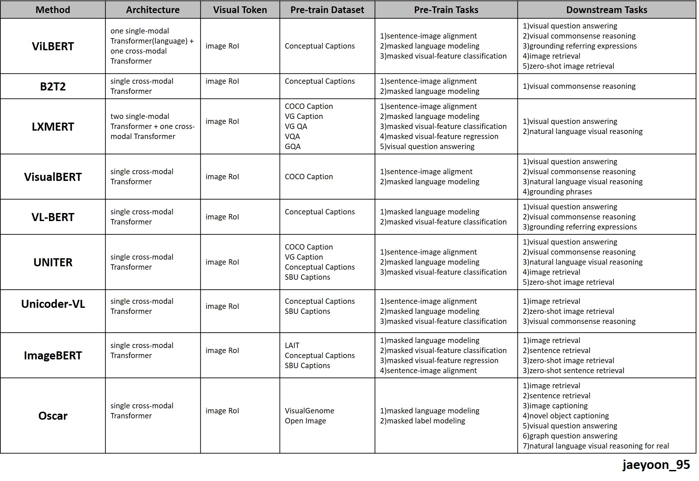

## Pretrained model summary   
* ### [pretrained language model](#pretrained-language-model)   
* ### [pretrained vision model](pretrained-vision-model)   
* ### [pretrained vision and language model](pretrained-vision-and-language-model)   
---
## Pretrained language model   
|**title**|**paper link**|**code link**|
|---|:---:|:---:|
|Improving Language Understanding by Generative Pre-Training|[[paper]](https://s3-us-west-2.amazonaws.com/openai-assets/research-covers/language-unsupervised/language_understanding_paper.pdf)|[[code(pytorch)]](https://github.com/huggingface/transformers)|
|ELMo : Deep contextualized word representations|[[paper]](https://arxiv.org/pdf/1802.05365.pdf)|[[code(tensorflow)]](https://github.com/yuanxiaosc/ELMo)|
|BERT: Pre-training of Deep Bidirectional Transformers for Language Understanding|[[paper]](https://arxiv.org/pdf/1810.04805.pdf)|[[code(tensorflow)]](https://github.com/google-research/bert)[[code(pytorch)]](https://github.com/codertimo/BERT-pytorch)|
|ALBERT: A LITE BERT FOR SELF-SUPERVISED LEARNING OF LANGUAGE REPRESENTATIONS|[[paper]](https://arxiv.org/pdf/1909.11942.pdf)|[[code(tensorflow)]](https://github.com/google-research/albert)[[code(pytorch)]](https://github.com/graykode/ALBERT-Pytorch)|
|RoBERTa: A Robustly Optimized BERT Pretraining Approach|[[paper]](https://arxiv.org/pdf/1907.11692.pdf)|[[code[pytorch]]](https://github.com/pytorch/fairseq/tree/master/examples/roberta)|
|Language Models are Unsupervised Multitask Learners|[[paper]](https://d4mucfpksywv.cloudfront.net/better-language-models/language-models.pdf)|[[code(tensorflow)]](https://github.com/openai/gpt-2)|
|Language Models are Few-Shot Learners|[[paper]](https://arxiv.org/pdf/2005.14165.pdf)|[[code]](https://github.com/openai/gpt-3)|
|XLNet: Generalized Autoregressive Pretraining for Language Understanding|[[paper]](https://arxiv.org/pdf/1906.08237.pdf)|[[code(tensorflow)]](https://github.com/zihangdai/xlnet)|
---
## Pretrained vision model   
|**title**|**paper link**|**code link**|
|---|:---:|:---:|
|Faster R-CNN: Towards Real-Time Object Detection with Region Proposal Networks|[[paper]](https://arxiv.org/pdf/1506.01497.pdf)|[[code(pytorch)]](https://github.com/longcw/faster_rcnn_pytorch)|
|Mask R-CNN|[[paper]](https://arxiv.org/pdf/1703.06870.pdf)|[[code(tensorflow)]](https://github.com/matterport/Mask_RCNN)[[code(pytorch)]](https://github.com/facebookresearch/maskrcnn-benchmark)|
|You Only Look Once: Unified, Real-Time Object Detection|[[paper]](https://arxiv.org/pdf/1506.02640.pdf)|[[code(tensorflow)]](https://github.com/gliese581gg/YOLO_tensorflow)|

---
## Pretrained vision and language model   
### summary table   
   

### papaer and code
|**title**|**paper link**|**code link**|
|---|:---:|:---:|
|ViLBERT: Pretraining Task-Agnostic Visiolinguistic Representations for Vision-and-Language Tasks|[[paper]](https://arxiv.org/pdf/1908.02265.pdf)|[[code(pytorch)]](https://github.com/jiasenlu/vilbert_beta)|
|12-in-1: Multi-Task Vision and Language Representation Learning|[[paper]](https://arxiv.org/pdf/1912.02315.pdf)|[[code(pytorch)]](https://github.com/facebookresearch/vilbert-multi-task)|
|LXMERT: Learning Cross-Modality Encoder Representations from Transformers|[paper](https://arxiv.org/pdf/1908.07490.pdf)|[code(pytorch)](https://github.com/airsplay/lxmert)|
|VISUALBERT: A SIMPLE AND PERFORMANT BASELINE FOR VISION AND LANGUAGE|[paper](https://arxiv.org/pdf/1908.03557.pdf)|[code(pytorch)](https://github.com/uclanlp/visualbert)|
